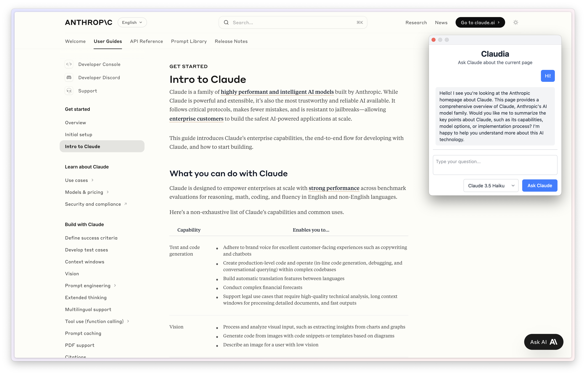

# Claudia

Claudia is a Chromium extension that lets you talk to Claude about the current page.

## Features

- Ask Claude about the current page. For example, ask it to summarize the current page or find specific information.
- Conversation support. For example, ask it to expand on a point from the previous response.
- Your API key is stored locally and all communications happen between your computer and Anthropic API.
- Page content is cached to save API costs.

## Installation

1. Download the latest [release](https://github.com/cubesort/claudia/releases).
2. Unzip the file.
3. Navigate to your browser’s extensions page, e.g. `chrome://extensions/`.
4. Enable "Developer mode" from the top right corner.
5. Click "Load unpacked" and select the unzipped folder.

## Usage

- Click on the extension icon in the toolbar.
- It will ask you to enter an Anthropic API key in the first use.
- Enter your API key and ask away!

## Developer guide

### System prerequisites

- Node >= v22

### Stack overview

- TypeScript
- React
- WXT: build tool

### Development

1. Clone the repo and `cd claudia`.
2. `npm install`.
3. `npm run dev`.
4. Check out [WXT documentation](https://wxt.dev/guide/essentials/config/browser-startup.html#browser-startup) to customize development experience.
