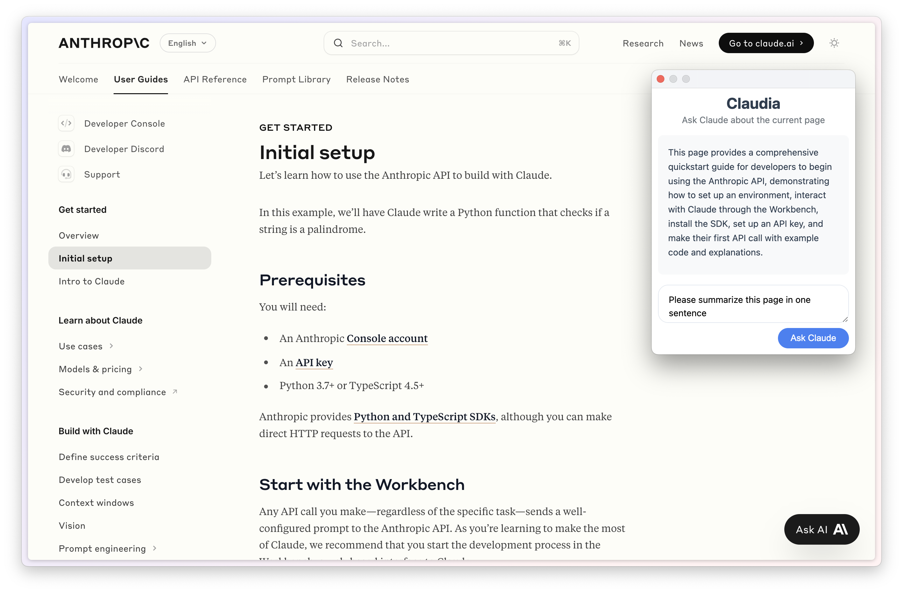

# Claudia

Claudia is a Chromium extension that lets you talk to Claude about the current page.

## Installation

1. Clone the repository or download and unzip the source code.
2. Navigate to the extensions page. It’s `chrome://extensions/` in Chrome.
3. Enable "Developer mode" from the top right corner.
4. Click "Load unpacked" and select the directory of the extension.

## Usage

- Click on the extension icon in the toolbar.
- It will ask you to enter an Anthropic API key in the first use.
- Enter your API key and ask away!
